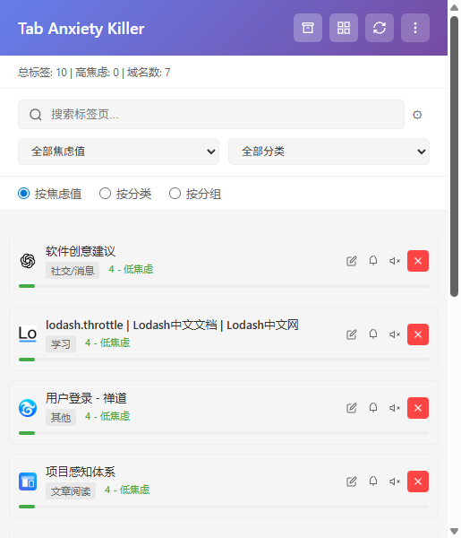
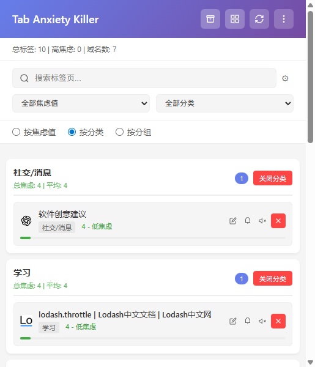
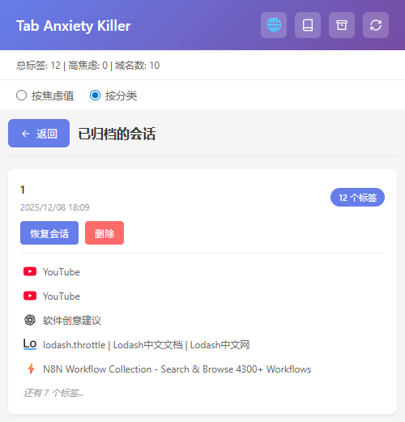

# Tab Anxiety Killer（非 AI 版）

智能轻巧的浏览器标签页管理器 - 自动分类、焦虑评分、一键归档

[](https://github.com)
[](https://chrome.google.com)
[](LICENSE)

## ✨ 功能特性

### ✅ 1. 自动分类 Tabs（基于 URL + Title 规则）

使用简单的规则分类，无需 AI：

- **购物类**：匹配域名（taobao, amazon, jd）+ 包含"cart""product"字样
- **社交/消息**：twitter / wechat / whatsapp / reddit
- **工作类**：GitHub、Jira、Confluence
- **学习**：docs、stackoverflow、mdn
- **视频娱乐**：youtube、bilibili
- **搜索类**：google 搜索页（q=参数）
- **文章阅读**：medium、知乎、blog

### ✅ 2. 一键归档（保存当前全部 tabs 作为 Session）

- 可以保存当前所有标签页为会话，方便后续恢复
- 支持自定义会话名称
- 查看所有已归档的会话列表
- 支持恢复会话（在新标签页中打开）
- 支持删除不需要的会话

### ✅ 3. Tabs 的"焦虑值"评分

非常实用的焦虑评分系统：

| 指标 | 算法 | 含义 |
|------|------|------|
| 已打开多久 | Date.now() - tab.lastAccessed | 时间越长越焦虑 |
| 是否重复域名 | count 相同 domain | 代表"太多用途不明的窗口" |
| 是否未聚焦超过 X 分钟 | tab.active=false 且 lastActiveTime | 可能是"不敢关但没用" |
| 是否是搜索结果页 | URL 包含 q= | 大概率能关 |
| 是否是文章阅读页 | scrollTop < 300px | 打开没看，也可能关 |

这些加权 = 一个"焦虑分数"，用来排序 tabs。

### ✅ 4. 一键处理建议（无需 AI）

自动给出处理建议：

- **明显可关闭**：搜索结果页、重复域名
- **可收藏归档**：长时间未访问的 docs、教程
- **建议暂存**：购物车、未完成文章
- **保持打开**：active tabs、音频正在播放 tab

### ✅ 5. 查看归档会话

- 点击顶部"查看归档"按钮（📚图标）
- 查看所有已保存的会话列表
- 显示会话名称、保存时间、标签页数量
- 预览前 5 个标签页
- 支持恢复会话和删除会话

### ✅ 6. 按分类关闭标签页

- 在"按分类"视图模式下
- 每个分类组都有"关闭分类"按钮
- 一键关闭该分类下的所有标签页
- 关闭前会显示确认对话框，防止误操作

### ✅ 7. 中英双语支持

- 支持中文（简体）和英文界面切换
- 点击顶部语言切换按钮（🌐）即可切换
- 语言偏好自动保存
- 所有界面文本、分类名称、焦虑等级均支持双语

### ✅ 8. Chrome 标签分组支持

- 支持按 Chrome 原生标签分组显示
- 自动识别标签页所属的分组
- 显示分组名称和标签页数量
- 支持按分组关闭标签页
- 显示分组的总焦虑值和平均焦虑值

### ✅ 9. 多主题风格

- **默认主题**：优雅的紫色渐变
- **暗色主题**：护眼的深色模式
- **浅色主题**：清爽的浅色模式
- **彩色主题**：活泼的彩色风格
- **高对比度主题**：无障碍高对比度模式
- 主题切换即时生效，偏好自动保存

### ✅ 10. 搜索和筛选功能

- **实时搜索**：支持标题、URL、分类搜索
- **正则表达式**：支持正则表达式搜索
- **大小写敏感**：可选的区分大小写选项
- **搜索历史**：自动保存搜索历史记录
- **搜索高亮**：搜索结果高亮显示
- **焦虑值筛选**：按焦虑等级筛选（高/中/低）
- **分类筛选**：按分类筛选标签页

### ✅ 11. 批量操作

- **批量选择**：支持多选标签页
- **全选/取消全选**：一键选择所有标签页
- **批量关闭**：一键关闭选中的标签页
- **批量归档**：一键归档选中的标签页
- **批量模式切换**：快捷键 `Ctrl/Cmd + B` 快速切换

### ✅ 12. 标签页操作增强

- **重命名标签页**：自定义标签页显示名称
- **固定/取消固定**：支持标签页固定功能
- **静音/取消静音**：支持标签页静音控制
- **状态显示**：显示固定、静音、音频播放状态
- **操作按钮**：每个标签页都有快速操作按钮

### ✅ 13. 会话管理增强

- **会话搜索**：支持搜索已归档的会话
- **会话重命名**：支持重命名已保存的会话
- **导出/导入**：支持导出会话为 JSON 文件，支持从 JSON 文件导入
- **会话统计**：显示会话的标签页数量、创建时间等信息
- **批量导出**：支持导出所有会话或选中的会话

### ✅ 14. 自定义分类规则

- **规则管理**：添加、编辑、删除自定义分类规则
- **正则表达式**：支持 URL 正则表达式匹配
- **规则优先级**：支持设置规则优先级
- **自定义分类名**：支持自定义分类名称
- **规则导入/导出**：支持规则的导入和导出

### ✅ 15. 自定义焦虑评分权重

- **权重调整**：可调整各维度焦虑评分权重
- **实时预览**：调整权重后实时预览效果
- **预设配置**：提供默认、激进清理、保守清理三种预设
- **重置功能**：一键重置为默认权重

### ✅ 16. 键盘快捷键

- `Ctrl/Cmd + K`：聚焦搜索框
- `Ctrl/Cmd + B`：切换批量模式
- `Delete`：关闭选中的标签页（批量模式）
- `Esc`：关闭菜单或取消操作
- `1-3`：切换视图模式（按焦虑值/按分类/按分组）
- `Tab`：在元素间导航
- `Enter`：激活按钮或链接

### ✅ 17. 统计图表和数据可视化

- **焦虑值分布**：显示焦虑值分布图表
- **分类分布**：显示各分类的标签页数量分布
- **数据统计**：显示总标签数、高焦虑标签数、域名数等

### ✅ 18. 通知和提醒 🔔

- **标签页数量提醒**：当标签页数量超过阈值时自动提醒
- **高焦虑标签页提醒**：当存在高焦虑值标签页时提醒
- **定期清理提醒**：按设定间隔提醒清理标签页（每天/每3天/每周/每月）
- **会话备份提醒**：按设定间隔提醒备份会话数据（每周/每2周/每月）
- **可配置阈值**：所有提醒都可以自定义阈值和间隔
- **测试通知**：支持测试通知功能

### ✅ 19. 无障碍功能 ♿

- **屏幕阅读器支持**：完整的 ARIA 标签和语义化 HTML
- **键盘导航优化**：所有功能都支持键盘操作
- **高对比度模式**：专门的高对比度主题，提高可读性
- **字体大小调整**：支持 12px-20px 字体大小调整
- **焦点可见性**：清晰的焦点指示，方便键盘导航
- **无障碍设置界面**：专门的无障碍设置页面

## 界面预览

### 主界面（按焦虑值排序）



主界面显示所有标签页，按焦虑值从高到低排序。每个标签页显示：
- 网站图标和标题
- 分类标签和焦虑值
- 焦虑值可视化进度条
- 一键关闭按钮

### 分类视图（按分类分组）



按分类视图将所有标签页按类别分组显示，每个分类组包含：
- 分类名称和标签页数量
- "关闭分类"按钮，可一键关闭该分类下的所有标签页
- 该分类下的所有标签页列表

### 归档会话视图



归档视图显示所有已保存的会话，包括：
- 会话名称和保存时间
- 标签页数量统计
- 前 5 个标签页预览
- 恢复和删除操作按钮

## 安装方法

### 方法一：不使用图标（快速开始）

当前版本已移除图标引用，可以直接加载使用。

### 方法二：生成图标（推荐）

1. 在浏览器中打开 `create-icons.html` 文件
2. 点击"下载"按钮，保存三个尺寸的图标文件
3. 将下载的图标文件（icon16.png, icon48.png, icon128.png）放到 `icons/` 目录
4. 恢复 `manifest.json` 中的图标配置（取消注释图标相关代码）

### 加载扩展

1. 打开 Chrome 浏览器
2. 访问 `chrome://extensions/`
3. 开启"开发者模式"
4. 点击"加载已解压的扩展程序"
5. 选择本项目文件夹

## 使用方法

### 基本操作

1. **打开扩展**：点击浏览器工具栏的扩展图标
2. **查看标签页**：
   - 切换到"按焦虑值"视图：按焦虑分数从高到低排序
   - 切换到"按分类"视图：按分类分组显示
3. **查看统计信息**：顶部显示总标签数、高焦虑标签数、域名数

### 标签页管理

1. **关闭单个标签页**：点击标签页右侧的"×"按钮
2. **按分类关闭**：
   - 切换到"按分类"视图
   - 找到要关闭的分类
   - 点击分类标题旁的"关闭分类"按钮
   - 确认后关闭该分类下的所有标签页
3. **使用智能建议**：
   - 查看顶部的处理建议区块
   - 点击"一键处理"按钮批量操作

### 归档功能

1. **保存当前会话**：
   - 点击顶部"归档"按钮（📦图标）
   - 输入会话名称（可选）
   - 会话已保存到本地存储

2. **查看归档会话**：
   - 点击顶部"查看归档"按钮（📚图标）
   - 浏览所有已保存的会话
   - 查看会话详情和标签页预览

3. **恢复会话**：
   - 在归档视图中找到要恢复的会话
   - 点击"恢复会话"按钮
   - 所有标签页会在新标签页中打开

4. **删除会话**：
   - 在归档视图中找到要删除的会话
   - 点击"删除"按钮
   - 确认后删除该会话

### 视图模式

- **按焦虑值**：按焦虑分数排序，高焦虑标签页优先显示
- **按分类**：按分类分组，方便批量管理同类标签页

## 文件结构

```
BrowserTabCleaning/
├── manifest.json          # 扩展配置文件
├── popup.html            # 弹窗界面
├── popup.js              # 弹窗主逻辑
├── i18n.js               # 国际化语言配置
├── themes.js             # 主题管理器
├── utils.js              # 工具函数（防抖、节流、缓存）
├── toast.js              # Toast 通知组件
├── tabClassifier.js      # 标签页分类器（规则引擎）
├── anxietyScorer.js      # 焦虑值评分器（评分算法）
├── tabManager.js         # 标签页管理器（核心功能）
├── background.js         # 后台服务脚本（通知、提醒）
├── content.js            # 内容脚本（标签页重命名）
├── styles.css            # 样式文件
├── icons/                # 图标目录
│   ├── icon16.png
│   ├── icon48.png
│   ├── icon128.png
│   └── README.md         # 图标说明
├── screenshots/          # 截图目录
│   └── README.md         # 截图说明
└── README.md            # 说明文档
```

## 技术实现

### 核心模块

- **tabClassifier.js**：标签页分类器
  - 基于域名匹配和关键词匹配的规则引擎
  - 支持 8 种分类：购物、社交、工作、学习、视频、搜索、阅读、其他
  - 可扩展的分类规则系统

- **anxietyScorer.js**：焦虑值评分器
  - 多维度加权评分系统（0-100分）
  - 5 个评分维度：打开时长、重复域名、未聚焦时长、搜索结果页、未读文章
  - 可配置的权重和阈值

- **tabManager.js**：标签页管理器
  - 标签页信息聚合和分类
  - 会话保存和恢复
  - 智能处理建议生成
  - 批量操作支持

### 技术栈

- **Chrome Extension API**：
  - `tabs`：标签页管理
  - `tabGroups`：Chrome 标签分组支持
  - `storage`：本地存储
  - `activeTab`：当前标签页操作
  - `notifications`：系统通知
  - `alarms`：定时提醒
  - `scripting`：内容脚本注入
- **存储**：Chrome Storage API（local storage）
- **UI**：原生 HTML/CSS/JavaScript，现代化响应式设计
- **图标**：SVG 矢量图标，支持高分辨率显示
- **国际化**：完整的 i18n 支持（中英文）
- **主题系统**：基于 CSS 变量的动态主题切换
- **无障碍**：完整的 ARIA 支持和键盘导航

## 注意事项

- **浏览器要求**：需要 Chrome 浏览器（支持 Manifest V3）
- **权限要求**：需要授予以下权限：
  - `tabs`：标签页管理
  - `tabGroups`：Chrome 标签分组支持
  - `storage`：本地存储
  - `activeTab`：当前标签页操作
  - `notifications`：系统通知
  - `alarms`：定时提醒
  - `scripting`：内容脚本注入（用于标签页重命名）
- **图标文件**：扩展图标已包含在 `icons/` 目录中
- **数据存储**：所有数据存储在浏览器本地，不会上传到服务器
- **隐私保护**：所有数据处理都在本地完成，不会收集任何用户信息
- **通知权限**：首次使用通知功能时，浏览器会请求通知权限
- **无障碍支持**：完全支持屏幕阅读器和键盘导航，符合 WCAG 2.1 标准

## 版本历史

### v1.0.1 (当前版本)

- 🔧 修复主题切换和语言切换按钮点击问题
- 🔧 优化更多菜单布局
- 🔧 减少不必要的提示通知
- ✨ 完善无障碍功能支持

### v1.0.0

- ✨ 初始版本发布

- ✨ 初始版本发布
- ✅ 核心功能：自动分类、焦虑评分、一键归档
- ✅ 多主题支持
- ✅ 中英双语支持
- ✅ 搜索和筛选功能
- ✅ 批量操作功能
- ✅ 自定义规则和权重
- ✅ 通知和提醒功能
- ✅ 无障碍功能支持
- ✅ 完整的键盘快捷键支持

## 使用技巧

1. **定期清理**：建议每天使用一次，保持标签页数量在合理范围
2. **分类管理**：使用"按分类"视图可以快速找到同类标签页
3. **归档重要会话**：在关闭标签页前，先归档保存重要的工作会话
4. **关注焦虑值**：高焦虑值的标签页通常是长时间未使用或重复的，可以优先关闭
5. **利用智能建议**：根据系统建议批量处理标签页，提高效率
6. **使用搜索功能**：快速定位特定标签页，支持正则表达式
7. **批量操作**：使用批量模式可以高效管理多个标签页
8. **自定义规则**：在设置中添加自定义分类规则，满足个性化需求
9. **调整权重**：根据使用习惯调整焦虑评分权重
10. **启用通知**：开启通知提醒，及时了解标签页状态
11. **使用快捷键**：掌握键盘快捷键，提高操作效率
12. **主题切换**：选择适合的主题，保护眼睛
13. **无障碍功能**：如有需要，启用高对比度模式和字体大小调整

## 常见问题

**Q: 归档的会话会占用多少存储空间？**  
A: 每个会话只保存 URL、标题和图标 URL，占用空间很小，通常每个会话只有几 KB。

**Q: 可以导出归档的会话吗？**  
A: ✅ 支持！在归档视图中点击"导出会话"按钮，可以导出为 JSON 文件。也支持从 JSON 文件导入会话。

**Q: 焦虑值是如何计算的？**  
A: 焦虑值基于 5 个维度加权计算：打开时长（30%）、重复域名（25%）、未聚焦时长（20%）、搜索结果页（15%）、未读文章（10%）。可以在设置中自定义权重。

**Q: 可以自定义分类规则吗？**  
A: ✅ 支持！在设置页面的"分类规则"标签页中，可以添加、编辑、删除自定义分类规则，支持正则表达式。

**Q: 支持键盘操作吗？**  
A: ✅ 完全支持！所有功能都可以通过键盘操作，支持 Tab 键导航和多种快捷键。详见"键盘快捷键"部分。

**Q: 通知功能如何使用？**  
A: 在设置页面的"通知和提醒"标签页中，可以开启各种提醒功能，并自定义阈值和间隔。

**Q: 如何调整字体大小？**  
A: 在设置页面的"无障碍设置"标签页中，可以使用滑块调整字体大小（12px-20px）。

**Q: 高对比度模式在哪里？**  
A: 在设置页面的"无障碍设置"标签页中，可以开启高对比度模式。也可以在主题选择器中选择"高对比度"主题。

## 已完成功能 ✅

- [x] 支持会话恢复功能
- [x] 按分类关闭标签页
- [x] 查看归档会话列表
- [x] SVG 图标优化
- [x] 中英双语支持
- [x] 支持自定义分类规则
- [x] 支持自定义焦虑评分权重
- [x] 添加统计图表和数据可视化
- [x] 支持导出/导入会话数据
- [x] 添加键盘快捷键支持
- [x] 支持标签页搜索功能（含正则表达式）
- [x] 添加多主题支持（默认、暗色、浅色、彩色、高对比度）
- [x] Chrome 标签分组支持
- [x] 批量操作功能
- [x] 标签页操作增强（重命名、固定、静音）
- [x] 会话管理增强（搜索、重命名、导出/导入）
- [x] 通知和提醒功能
- [x] 无障碍功能（屏幕阅读器、键盘导航、高对比度、字体调整）

## 未来改进

- [ ] 智能建议增强（学习用户习惯）
- [ ] 数据分析和报告（每日/每周/每月报告）
- [ ] 高级筛选和排序（多条件组合）
- [ ] 标签页分组操作（创建、移动、重命名分组）
- [ ] 性能监控和优化
- [ ] 跨设备同步（需要后端支持）
- [ ] 与 Chrome 书签同步
- [ ] 标签页截图预览

